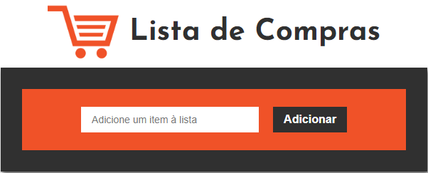
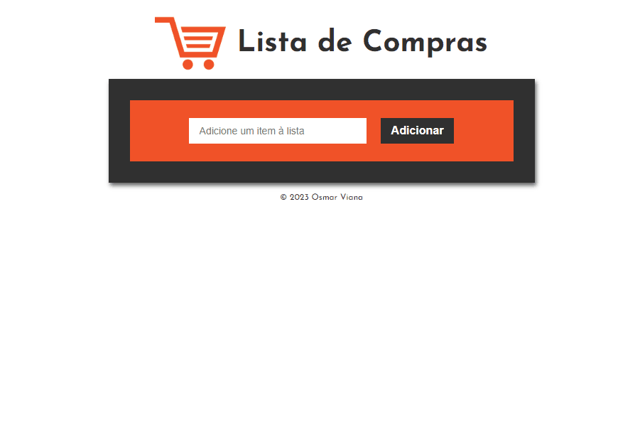
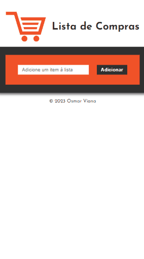

 

# Lista de Compras

Você cria sua lista de compras de supermercado adicionando os itens que deseja comprar e vai atualizando com valor e quantidade de cada item. Assim você terá um controle do que vai comprar e dos valores, possibilitando que gaste apenas aquilo que se propõe a gastar e não sai do orçamento.

 

# 📑Índice

#### Visão Geral

#### Projeto

#### Tecnologia Usada

#### Instalação

#### Uso

#### Autor

 

# 👁‍🗨Visão Geral

O projeto foi desenvolvido utilizando React, estilizado com o styled components.

Desktop Design

 

Mobile Design

>

 

# 📦Projeto

O projeto foi criado como um SPA (Single Page Application) aplica funções simples com operações matemáticas e manipulação do DOM. A estilização foi feita com a biblioteca Styled Component.

 

# 💻Funcionalidades

- Adiciona itens numa lista, como um carrinho de compras;
- calcula valor total por item x quantidade;
- calcula valor total das compras;

 

# 🔧Tecnologia Usada

- React
- Styled Components

 

# 💾Instalação

1. Clone o repositório ou baixe os arquivos do projeto.
2. Instale as dependências necessárias executando npm install ou yarn install.

 

# 👣Uso

1. Execute o comando npm start ou yarn start para iniciar o servidor de desenvolvimento.
2. Abra o aplicativo em seu navegador da Web navegando até http://localhost:3000.
3. Navegue pela página para testar as funcionalidades.

 

# 👦🏻Autor

## Osmar Viana

 

## 🔗Links

  
   

  
   
  
   
  
   

